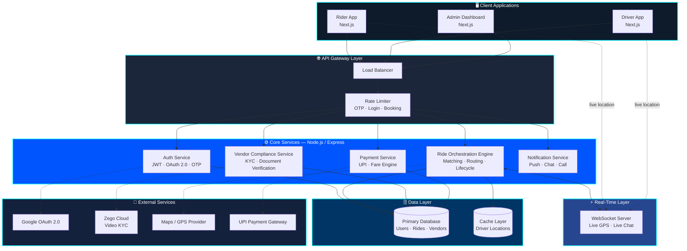
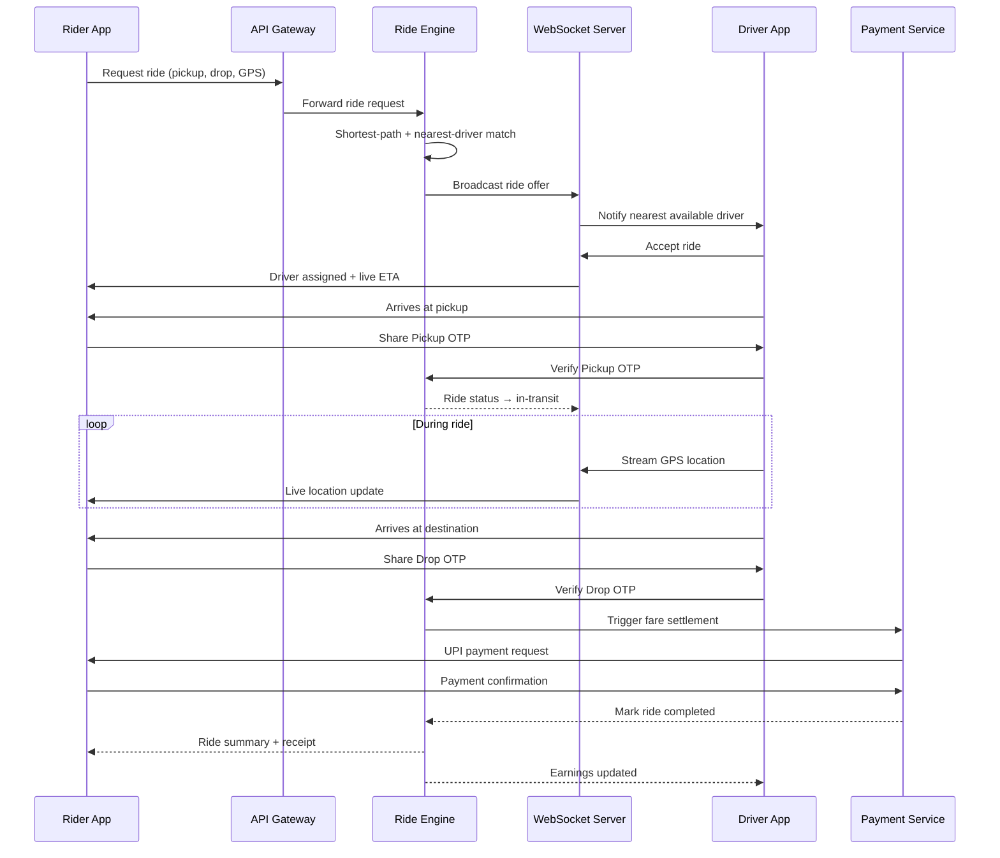

<p align="center">
  
</p>

<p align="center">
  <b>Enterprise-Grade AI-Powered Ride-Hailing &amp; Mobility Infrastructure</b>
</p>

<p align="center">
  
  
  
  
  
  
  
  
</p>

<p align="center">
  
  
  
  
  
</p>

<p align="center">
  <a href="#-live-demo">Live Demo</a> •
  <a href="#-executive-summary">Executive Summary</a> •
  <a href="#-system-architecture">Architecture</a> •
  <a href="#-core-engineering-modules">Engineering Modules</a> •
  <a href="#-security-model">Security Model</a> •
  <a href="#-scalability--infrastructure-strategy">Scalability</a> •
  <a href="#-tech-stack">Tech Stack</a> •
  <a href="#-roadmap">Roadmap</a> •
  <a href="#-author">Author</a>
</p>

---

## 🧭 Executive Summary

**RYDEX** is a full-stack, enterprise-grade mobility platform architected to mirror the operational complexity of real-world ride-hailing systems — comparable in design philosophy to Uber, Ola, and Lyft's core service layers.

It is not a boilerplate clone. RYDEX is a **systems engineering exercise**, deliberately built around the four pillars that define production mobility platforms:

| Pillar | What It Means Here |
|---|---|
| 🔐 **Trust & Identity** | Multi-factor OTP verification, OAuth 2.0, KYC video verification, role-based access |
| ⚡ **Real-Time Infrastructure** | Live GPS sync, live tracking, live chat/call, live earnings dashboards |
| 🧠 **Algorithmic Intelligence** | Graph-based shortest-path routing, nearest-driver allocation, dynamic fare computation |
| 🏗️ **Operational Governance** | Multi-stage admin approval pipelines, fraud detection, revenue analytics |

The result is a platform engineered for **horizontal scale, auditability, and security-first design** — the same principles that govern production fintech and mobility infrastructure.

---

## 🌐 Live Demo

| Environment | Link |
|---|---|
| 🛡️ Admin Command Center | [Launch Admin Dashboard](https://rydex-smart-al-powered-ride-hailing-rho.vercel.app/admin/dashboard) |
| 🎥 Full Walkthrough | [Demo Video (Google Drive)](https://drive.google.com/file/d/1M6gp-WgwNSNYZbsABlcvqf2kXTqDKwCO/view?usp=sharing) |

---

## 🏗️ System Architecture

RYDEX follows a **layered, service-oriented architecture** — cleanly separating identity, ride orchestration, payments, and analytics into independently reasoned-about domains, laying the groundwork for a future microservices migration.



### Ride Lifecycle — Sequence Flow



### Architectural Principles

- **Separation of concerns** — User, Driver, and Admin domains operate on isolated logic paths with shared core services (auth, notifications, payments)
- **Stateless authentication** — JWT-based sessions enable horizontal scaling without sticky-session dependencies
- **Event-driven ride lifecycle** — Ride state transitions (`requested → assigned → picked-up → in-transit → completed`) are treated as discrete, trackable events
- **Defense-in-depth security** — Multiple independent verification layers (OTP, OAuth, KYC, rate limiting) rather than a single point of trust

---

## ⚙️ Core Engineering Modules

### 1️⃣ Identity & Trust Layer
- OTP-based sign-up/login verification
- Google OAuth 2.0 federated authentication
- Role-based access control (User / Driver / Admin) enforced at the middleware layer
- JWT session tokens with expiry & refresh handling

### 2️⃣ Ride Orchestration Engine
- Real-time GPS-based ride booking
- **Graph-based shortest-path algorithm** for route optimization
- Nearest-available-driver allocation logic
- Dual-checkpoint OTP verification (pickup + drop) as ride-integrity gates
- Live map-based tracking during active rides

### 3️⃣ Vendor Compliance Pipeline
- Structured document ingestion: Aadhaar, Driving License, Vehicle RC, Bank Details
- **Video KYC** verification via Zego Cloud SDK
- Multi-category vehicle onboarding: Bike, Auto, Car, Truck, Loading Vehicle
- Sequential approval gate: `Document Verification → Video Verification → Vehicle Approval → Activation`

### 4️⃣ Financial & Analytics Layer
- UPI / online payment integration
- Dynamic, real-time fare estimation engine
- Day-wise earnings analytics (Admin + Vendor dashboards)
- Today-vs-Yesterday comparative revenue tracking
- Platform-wide revenue aggregation for admin oversight

### 5️⃣ Communication Layer
- In-app chat with assigned driver
- In-app voice call integration
- Real-time ride-status notifications

<p align="center">
  
</p>

---

## 🔐 Security Model

RYDEX applies a **defense-in-depth** posture — no single mechanism is trusted in isolation.

| Layer | Control | Purpose |
|---|---|---|
| API Gateway | ⏱️ Rate limiting (OTP, login, booking endpoints) | Prevents brute-force & abuse |
| Traffic Layer | ⚖️ Load-balancing design | Distributes load, avoids single points of failure |
| Session Layer | 🔑 JWT authentication | Stateless, horizontally scalable auth |
| Identity Layer | 🔐 Google OAuth 2.0 | Federated, phishing-resistant login option |
| Ride Integrity | 📲 Dual OTP checkpoints | Confirms correct pickup & drop parties |
| Access Layer | 🧠 Role-based access control | Enforces least-privilege per role |
| Vendor Trust | 🎥 Video KYC | Human-verified identity for drivers |
| Platform Oversight | 🚨 Fraud detection system | Flags anomalous ride/payment patterns |

---

## 🧠 AI & Algorithmic Intelligence

- 🧭 **Shortest-path graph routing** — Dijkstra-style optimization for driver-rider matching
- 🚖 **Smart allocation engine** — proximity + availability-weighted driver assignment
- 💰 **Dynamic fare computation** — distance, vehicle class, and demand-aware pricing
- 📈 **ML-ready analytics foundation** — data pipeline structured for future demand-prediction models

---

## 📈 Scalability & Infrastructure Strategy

RYDEX's architecture is designed with a clear scaling path in mind:

```
Current:   Monolithic Next.js + Node.js  →  Rate-limited, load-balanced API layer
Next:      Domain-driven service boundaries (Ride / Vendor / Payment / Admin)
Future:    Microservices  →  Container orchestration (Kubernetes)  →  Auto-scaling pods
```

- **Stateless services** enable safe horizontal scaling behind a load balancer
- **Rate limiting** protects critical endpoints (OTP, auth, booking) from abuse under load
- **Analytics pipeline** structured for future stream-processing (e.g., Kafka-based event ingestion)
- **Multi-stage approval workflows** designed to be queue-based, decoupling verification latency from user-facing performance

---

## 🔄 Ride Lifecycle

```
1. Identity Verification   →  OTP + Google OAuth
2. Ride Request             →  Live GPS location capture
3. Driver Assignment        →  Shortest-path + nearest-available logic
4. Pickup Checkpoint        →  OTP verification #1
5. Live Tracking             →  Real-time map synchronization
6. Drop Checkpoint           →  OTP verification #2
7. Settlement                →  UPI / online payment completion
8. Post-Ride Analytics       →  Ride history + earnings updated
```

---

## ⚙️ Tech Stack

<p align="center">
  
</p>

| Domain | Technologies |
|---|---|
| Frontend | Next.js, React, modern responsive UI |
| Backend | Node.js, Express-style API layer |
| Auth | JWT, Google OAuth 2.0, OTP services |
| Real-Time | GPS tracking, live map sync, live chat/call |
| Identity Verification | Zego Cloud (Video KYC) |
| Payments | UPI / online payment gateway integration |
| Deployment | Vercel (current), Kubernetes-ready (future) |

---

## 💡 Engineering Philosophy

RYDEX is built on the belief that a portfolio project should be held to **production standards**, not tutorial standards:

- 🏗️ Architecture that anticipates scale, not just demo traffic
- 🔒 Security modeled as layered defense, not a single login form
- ⚡ Real-time systems treated as first-class citizens, not bolted-on features
- 🧠 Algorithmic decision-making (routing, allocation, pricing) instead of hardcoded logic
- 🎯 Admin governance workflows that mirror real operational compliance needs

---

## 🚀 Roadmap

- [ ] 🤖 ML-based demand prediction
- [ ] 📈 Dynamic surge pricing engine
- [ ] 🧩 Microservices decomposition (Ride / Vendor / Payment / Admin)
- [ ] ☸️ Kubernetes-based container orchestration & auto-scaling
- [ ] 🛡️ Advanced, ML-driven fraud detection
- [ ] 📡 Event-streaming pipeline (Kafka) for real-time analytics

---

## 👨‍💻 Author

<div align="center">


### **Biswajit Pattanaik**
**Full-Stack Developer • System Design Engineer • AI Integration • Backend Engineering • UI/UX Designer • DevOps & Deployment Engineer**

Designed, engineered, and deployed the **entire RYDEX platform** end-to-end — system architecture, backend services, frontend experience, security model, and production infrastructure — as a single-owner, production-grade build.

<a href="https://github.com/Biswajitpa"></a>


<br/><br/>

⭐ **If this project helped or inspired you, consider giving it a star!** ⭐


</div>
